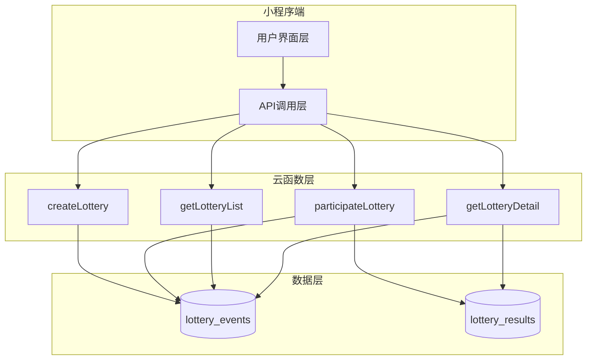

# 设计文档

## 概述

本系统是一个基于微信小程序云开发模式的抽签应用，采用前后端分离架构。前端使用微信小程序框架，后端使用微信云函数和云数据库。系统的核心功能是创建抽签活动、随机分配任务给参与者，并提供完整的历史记录查询。

技术栈：
- 前端：微信小程序（WXML, WXSS, JavaScript）
- 后端：微信云函数（Node.js）
- 数据库：微信云数据库（文档型数据库）
- 认证：微信小程序内置身份认证

## 架构

系统采用三层架构：



架构说明：
- 用户界面层：负责展示和用户交互
- API调用层：封装云函数调用，处理请求和响应
- 云函数层：实现业务逻辑，处理数据验证和操作
- 数据层：持久化存储抽签活动和结果数据

## 组件和接口

### 小程序端组件

#### 1. 页面组件

**pages/index/index**
- 功能：主页，提供创建抽签和查看历史记录的入口
- 方法：
  - `navigateToCreate()`: 跳转到创建抽签页面
  - `navigateToHistory()`: 跳转到历史记录页面

**pages/create/create**
- 功能：创建抽签活动表单页面
- 数据：
  - `title`: 抽签标题
  - `categories`: 类目列表 [{name, quantity}]
  - `startTime`: 开始时间
  - `endTime`: 结束时间
- 方法：
  - `addCategory()`: 添加新类目
  - `removeCategory(index)`: 删除指定类目
  - `validateForm()`: 验证表单数据
  - `submitLottery()`: 提交创建抽签

**pages/history/history**
- 功能：显示用户创建的抽签活动列表
- 数据：
  - `lotteryList`: 抽签活动列表
- 方法：
  - `loadLotteryList()`: 加载抽签列表
  - `navigateToDetail(id)`: 跳转到详情页面
  - `getStatus(event)`: 计算活动状态

**pages/detail/detail**
- 功能：显示抽签活动详情和结果
- 数据：
  - `lotteryEvent`: 活动基本信息
  - `results`: 抽签结果列表
- 方法：
  - `loadLotteryDetail(id)`: 加载活动详情
  - `participateLottery()`: 参与抽签
  - `refreshResults()`: 刷新结果

#### 2. API服务层

**utils/api.js**
- 功能：封装云函数调用
- 方法：
  - `createLottery(data)`: 调用创建抽签云函数
  - `participateLottery(eventId)`: 调用参与抽签云函数
  - `getLotteryList()`: 调用获取列表云函数
  - `getLotteryDetail(eventId)`: 调用获取详情云函数

### 云函数组件

#### 1. createLottery 云函数

**输入参数：**
```javascript
{
  title: String,           // 抽签标题
  categories: [{           // 类目列表
    name: String,          // 类目名称
    quantity: Number       // 类目数量
  }],
  startTime: Date,         // 开始时间
  endTime: Date            // 结束时间
}
```

**输出：**
```javascript
{
  success: Boolean,
  eventId: String,         // 活动ID
  message: String          // 提示信息
}
```

**逻辑：**
1. 验证输入参数（标题、类目、时间）
2. 获取用户 openid
3. 构造活动数据对象
4. 插入到 lottery_events 集合
5. 返回活动ID

#### 2. participateLottery 云函数

**输入参数：**
```javascript
{
  eventId: String          // 活动ID
}
```

**输出：**
```javascript
{
  success: Boolean,
  category: String,        // 抽中的类目
  message: String
}
```

**逻辑：**
1. 获取用户 openid
2. 查询活动信息，验证时间范围
3. 检查用户是否已参与
4. 获取可用类目（剩余数量 > 0）
5. 随机选择一个类目
6. 更新类目剩余数量（原子操作）
7. 插入抽签结果到 lottery_results 集合
8. 返回抽中的类目

#### 3. getLotteryList 云函数

**输入参数：** 无

**输出：**
```javascript
{
  success: Boolean,
  list: [{
    _id: String,
    title: String,
    startTime: Date,
    endTime: Date,
    createTime: Date,
    status: String         // 'ongoing' | 'ended'
  }]
}
```

**逻辑：**
1. 获取用户 openid
2. 查询该用户创建的所有活动
3. 按创建时间倒序排序
4. 返回活动列表

#### 4. getLotteryDetail 云函数

**输入参数：**
```javascript
{
  eventId: String
}
```

**输出：**
```javascript
{
  success: Boolean,
  event: {
    _id: String,
    title: String,
    categories: [{
      name: String,
      quantity: Number,
      remaining: Number
    }],
    startTime: Date,
    endTime: Date,
    creatorId: String
  },
  results: [{
    userId: String,
    category: String,
    createTime: Date
  }]
}
```

**逻辑：**
1. 获取用户 openid
2. 查询活动信息
3. 验证用户权限（创建者或参与者）
4. 查询该活动的所有抽签结果
5. 返回活动详情和结果列表

## 数据模型

### lottery_events 集合

存储抽签活动信息。

```javascript
{
  _id: String,              // 自动生成的文档ID
  title: String,            // 抽签标题，最大50字符
  categories: [{            // 类目列表
    name: String,           // 类目名称
    quantity: Number,       // 总数量
    remaining: Number       // 剩余数量
  }],
  startTime: Date,          // 开始时间
  endTime: Date,            // 结束时间
  creatorId: String,        // 创建者openid
  createTime: Date,         // 创建时间戳
  _openid: String           // 微信云数据库自动字段
}
```

**索引：**
- `creatorId`: 用于查询用户创建的活动列表
- `createTime`: 用于按时间排序

### lottery_results 集合

存储用户抽签结果。

```javascript
{
  _id: String,              // 自动生成的文档ID
  eventId: String,          // 关联的活动ID
  userId: String,           // 参与者openid
  category: String,         // 抽中的类目名称
  createTime: Date,         // 抽签时间戳
  _openid: String           // 微信云数据库自动字段
}
```

**索引：**
- `eventId`: 用于查询某个活动的所有结果
- `userId + eventId`: 复合索引，用于检查用户是否已参与

## 正确性属性


属性是一种特征或行为，应该在系统的所有有效执行中保持为真——本质上是关于系统应该做什么的形式化陈述。属性作为人类可读规范和机器可验证正确性保证之间的桥梁。

### 核心功能属性

**属性 1: 创建活动数据往返一致性**

对于任意有效的抽签活动数据（标题、类目、时间范围），创建活动后立即查询应该返回相同的数据。

**验证需求：5.1**

**属性 2: 输入验证完整性**

对于任意抽签活动输入数据，验证函数应该正确拒绝以下无效情况：
- 标题为空或超过50字符
- 任何类目名称为空或数量不是正整数
- 开始时间不早于结束时间
- 开始时间早于当前时间

**验证需求：1.2, 1.3, 1.4, 1.5**

**属性 3: 唯一活动ID生成**

对于任意成功创建的抽签活动，系统应该返回一个唯一的活动ID，且该ID可用于后续查询。

**验证需求：1.6**

**属性 4: 参与时间范围验证**

对于任意抽签活动和参与时间，系统应该仅在当前时间位于活动的开始时间和结束时间之间时允许参与。

**验证需求：2.1**

**属性 5: 重复参与防护**

对于任意用户和抽签活动，如果用户已经参与过该活动，再次参与应该被拒绝。

**验证需求：2.2**

**属性 6: 类目分配有效性**

对于任意有可用类目的抽签活动，参与抽签应该分配一个剩余数量大于0的类目。

**验证需求：2.3, 2.4**

**属性 7: 类目数量不变量**

对于任意抽签活动，成功分配一个类目后，该类目的剩余数量应该减少1，且所有类目的已分配数量之和应该等于参与人数。

**验证需求：2.7**

**属性 8: 抽签结果持久化往返**

对于任意成功的抽签参与，结果应该被保存到数据库，且立即查询应该能够检索到该结果。

**验证需求：2.6, 5.2**

**属性 9: 用户活动隔离**

对于任意用户，查询历史记录应该仅返回该用户创建的活动，不包含其他用户创建的活动。

**验证需求：3.1, 6.3**

**属性 10: 活动列表渲染完整性**

对于任意活动列表，渲染结果应该包含每个活动的标题、创建时间和状态字段。

**验证需求：3.2**

**属性 11: 活动详情渲染完整性**

对于任意抽签活动，详情页面应该包含活动的标题、时间范围、状态以及所有类目的信息（名称、总数量、已分配数量）。

**验证需求：4.1, 4.3**

**属性 12: 结果分组正确性**

对于任意抽签活动的结果集，按类目分组后，每个参与者应该恰好出现在一个类目组中。

**验证需求：4.2**

**属性 13: 数据完整性**

对于任意存储到数据库的记录（活动或结果），应该包含创建时间戳和用户openid字段。

**验证需求：5.3**

**属性 14: 权限验证**

对于任意用户和抽签活动，用户只有在是活动创建者或参与者的情况下才能查看活动详情。

**验证需求：6.4**

**属性 15: 云函数身份传递**

对于任意云函数调用，请求上下文应该包含调用用户的openid。

**验证需求：6.2**

**属性 16: 错误信息返回**

对于任意失败的操作（验证失败、数据库错误、网络错误），系统应该返回包含错误类型和描述信息的错误对象。

**验证需求：5.5, 7.1, 7.2, 7.3**

**属性 17: UI状态管理**

对于任意异步操作（创建、参与、查询），在操作进行中应该显示加载状态，操作完成后应该清除加载状态并显示结果或错误提示。

**验证需求：8.4, 8.5**

**属性 18: 动态类目管理**

对于任意类目列表，添加操作应该增加列表长度，删除操作应该减少列表长度，且操作后的列表应该保持有效状态。

**验证需求：8.2**

### 边界情况和示例测试

以下情况应该通过单元测试验证：

**示例 1: 空列表状态**
- 当用户没有创建任何活动时，历史记录页面应该显示空状态提示
- **验证需求：3.3**

**示例 2: 无参与者状态**
- 当活动没有任何参与者时，详情页面应该显示空状态提示
- **验证需求：4.5**

**示例 3: 类目已满**
- 当所有类目的剩余数量都为0时，参与抽签应该返回"抽签已满"错误
- **验证需求：2.5**

**示例 4: 首次授权**
- 用户首次打开小程序时，应该触发微信授权流程
- **验证需求：6.1**

**示例 5: 时间过期错误**
- 当用户尝试参与已结束的活动时，应该返回"活动已结束"错误
- **验证需求：7.4**

**示例 6: 重复参与错误**
- 当用户尝试重复参与同一活动时，应该返回"已参与过"错误
- **验证需求：7.5**

## 错误处理

### 错误类型定义

系统定义以下错误类型：

```javascript
const ErrorTypes = {
  VALIDATION_ERROR: 'VALIDATION_ERROR',       // 输入验证失败
  TIME_RANGE_ERROR: 'TIME_RANGE_ERROR',       // 时间范围错误
  DUPLICATE_ERROR: 'DUPLICATE_ERROR',         // 重复操作
  NOT_FOUND_ERROR: 'NOT_FOUND_ERROR',         // 资源不存在
  PERMISSION_ERROR: 'PERMISSION_ERROR',       // 权限不足
  CAPACITY_ERROR: 'CAPACITY_ERROR',           // 容量已满
  DATABASE_ERROR: 'DATABASE_ERROR',           // 数据库错误
  NETWORK_ERROR: 'NETWORK_ERROR'              // 网络错误
}
```

### 错误处理策略

**云函数层：**
1. 捕获所有异常并转换为标准错误格式
2. 记录错误日志到云日志
3. 返回错误类型和用户友好的错误消息
4. 不暴露敏感的系统信息

**小程序端：**
1. 统一的错误处理中间件
2. 根据错误类型显示相应的提示信息
3. 网络错误时提供重试选项
4. 关键操作失败时记录到本地日志

### 错误响应格式

```javascript
{
  success: false,
  errorType: String,      // 错误类型
  message: String,        // 用户友好的错误消息
  details: Object         // 可选的详细信息（仅开发环境）
}
```

### 具体错误场景

1. **验证错误**：表单字段旁显示具体错误信息
2. **时间错误**：Toast提示"活动未开始"或"活动已结束"
3. **重复参与**：Toast提示"您已参与过此次抽签"
4. **类目已满**：Toast提示"抽签名额已满"
5. **权限错误**：Toast提示"无权限查看"并返回上一页
6. **网络错误**：Toast提示"网络连接失败，请重试"
7. **数据库错误**：Toast提示"操作失败，请稍后重试"

## 测试策略

### 测试方法

本系统采用双重测试方法：

1. **单元测试**：验证特定示例、边界情况和错误条件
2. **属性测试**：验证跨所有输入的通用属性

两者是互补的，共同提供全面的测试覆盖。单元测试捕获具体的错误，属性测试验证通用的正确性。

### 单元测试策略

单元测试应该专注于：
- 特定示例，展示正确行为
- 组件之间的集成点
- 边界情况和错误条件

避免编写过多的单元测试——属性测试已经处理了大量输入的覆盖。

**测试范围：**

1. **云函数测试**
   - 使用微信云开发测试工具
   - 模拟数据库操作
   - 测试各种输入场景和错误情况

2. **小程序端测试**
   - 使用微信开发者工具的自动化测试
   - 测试页面渲染和交互
   - 测试API调用和错误处理

3. **数据模型测试**
   - 验证数据结构的完整性
   - 测试数据验证逻辑

### 属性测试策略

**测试库选择：**
- 使用 `fast-check` 库进行属性测试（Node.js环境）
- 每个属性测试至少运行100次迭代

**属性测试配置：**

每个属性测试必须：
1. 引用设计文档中的属性编号
2. 使用标签格式：`Feature: lottery-assignment-miniapp, Property {number}: {property_text}`
3. 每个正确性属性由单个属性测试实现

**测试覆盖：**

属性测试应该覆盖：
- 属性1-18：所有核心功能属性
- 使用随机生成的测试数据
- 验证不变量和往返属性
- 测试跨多种输入组合的行为

**示例属性测试结构：**

```javascript
// Feature: lottery-assignment-miniapp, Property 1: 创建活动数据往返一致性
fc.assert(
  fc.property(
    lotteryEventArbitrary,
    async (eventData) => {
      const { eventId } = await createLottery(eventData);
      const retrieved = await getLotteryDetail(eventId);
      return deepEqual(eventData, retrieved.event);
    }
  ),
  { numRuns: 100 }
);
```

### 测试环境

1. **开发环境**：使用云开发测试环境，独立的数据库实例
2. **CI/CD**：自动化测试在代码提交时运行
3. **测试数据**：使用工厂函数生成测试数据，测试后清理

### 测试优先级

1. **高优先级**：核心功能属性（属性1-8）
2. **中优先级**：数据展示和权限属性（属性9-15）
3. **低优先级**：UI状态和错误处理属性（属性16-18）

所有边界情况示例测试都应该实现。
